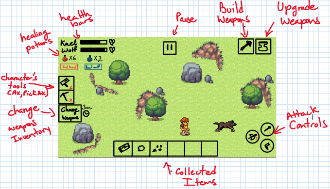
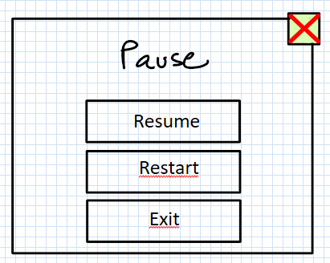

# **Wild Frontier: The Rescue**

## _Game Design Document_

---

##### **© 2023 Kali, All rights reserved/ Santiago Benitez, Carlos Soto, Ian Vázquez /**

##

## _Index_

---

1. [Index](#index)
2. [Game Design](#game-design)
   1. [Summary](#summary)
   2. [Gameplay](#gameplay)
   3. [Mindset](#mindset)
3. [Technical](#technical)
   1. [Screens](#screens)
   2. [Controls](#controls)
   3. [Mechanics](#mechanics)
4. [Level Design](#level-design)
   1. [Themes](#themes)
      1. Ambience
      2. Objects
         1. Ambient
         2. Interactive
      3. Challenges
   2. [Game Flow](#game-flow)
5. [Development](#development)
   1. [Abstract Classes](#abstract-classes--components)
   2. [Derived Classes](#derived-classes--component-compositions)
6. [Graphics](#graphics)
   1. [Style Attributes](#style-attributes)
   2. [Graphics Needed](#graphics-needed)
7. [Sounds/Music](#soundsmusic)
   1. [Style Attributes](#style-attributes-1)
   2. [Sounds Needed](#sounds-needed)
   3. [Music Needed](#music-needed)
8. [Schedule](#schedule)

## _Game Design_

---

### **Summary**

The game follows the story of a hunter-gatherer named Kael, who lives in a small tribe of nomads in the pre-civilization world. In this world, tribes are identified with an animal and kael´s tribe is recognized as the wolf tribe. Kael's tribe is in dispute with other tribes over the grasslands in prehistoric Europe and his life takes a dramatic turn when his young son is kidnapped by the leader of the Bear tribe in revenge for the disagreement of a treaty among tribes.

Determined to rescue his son, Kael sets out on a perilous journey through the forbidden forest, the Sarcos Lake and the settlement of the Bear tribe, where he must fight against the Bear tribesmen along with his tribe´s emblematic animal, the wolf, who will help him determine the path to follow in order to find his son. As Kael goes through this journey, he must ensure the protection of the wolf. To fight off enemies and protect the wolf, Kael gathers resources from the environment to craft his own weapons.

Kael finally reaches the settlement of the Bear tribe, where he engages in a fierce battle with the most menacing tribesmen and the leader of the tribe. Using all of his skills and weapons to overcome the powerful tribe, Kael will try to rescue his son.

Wild Frontier: The Rescue will be a 2D action Role Playing Game with real-time combat system. It will be based on pixel art videogames with a top down view. Players can expect a thrilling and immersive RPG experience with a focus on action. As the designers of this game, we want the innovation of this product to lie in providing the player with a feeling of responsibility towards the companion of the player (the wolf) throughout the game. This is embedded as much as possible into the game to the degree where the player needs to apply the best strategy to ensure the protection of the wolf in order to move on to the next levels.

### **Gameplay**

The game is set in a pre-civilization world and the player takes on the role of the main character Kael as he goes through different levels where he has to scavenge for resources such as materials for crafting weapons to kill the enemies and protect his tribe´s animal, the wolf, to track his son down.

The player starts the game in the forbidden forest where he can explore the world and learn to craft his first weapons by interacting with the environment. The main character has two initial tool, the hand axe, which can be used to chop down trees and a pick axe, to work the stone rocks to craft different weapons. The weapons that can be crafted are bows and arrows, wooden sword, slingshots, spears, boomerangs and stone knives and each of them require different resources/materials that the player needs to collect from the environment.

The weapons have different stats that describe a characteristic about the weapon, such as the amount of damage the weapon inflicts when it hits an enemy (damage), the speed with which the weapon can execute an attack (speed) and the resistance of the weapon efficiency of the weapon during combat (efficiency).

The goal of the game is to rescue the son from the leader of the Bear Tribe. In order to do this, the player must decide to craft the best weapons to fight off enemies and protect the wolf throughout the level. The wolf will travel from point A to point B and during each level and the player must make its way through the world fighting off enemies and ensuring the protection of its companion.

The player is able to walk, run, and attack in different ways depending on the weapon being used. In the beginning of the game, the player starts off with a fairly weak and poorly equipped character. As the player goes through the levels, he can increase the stats of the weapons that he crafts using the wood and rock that is recollected or to restore his health bar by creating health potions with healing remedies that he can collect when enemies are killed.

The player will start with a full health bar and whenever the player takes damage from an enemy attack, an amount of the health will be deducted depending on the strength of the enemy attack.
Throughout the game, the player can customize the main character by deciding the weapons which will be used at a certain moment to attack enemies. The player is able to craft the weapons mentioned above but it is only allowed to carry 2 weapons at once. Therefore, the player can select only 3 weapons from the inventory, and can change his current weapons every 3 minutes.

As the player progresses through the game, he will encounter more challenging enemies, requiring him to use different strategies and weapons to defeat them. Enemies are of three types: Grims are short range attacking enemies that use a stone knife to attack the player. Impalers are also short range attacking enemies that use a spear to attack the player. Finally, Marauders are long range attacking enemies that throw arrows at the player.

### **Mindset**

As the game designers of this game we would want to provoke a sense of adventure and excitement in the player. The game is set in a pre-civilization world with different types of enemies that require different strategies and weapons to defeat. This encourages the player to explore the environment, scavenge for resources, and craft weapons to progress through the game.

At the same time, the limited carry capacity of weapons and cooldown effect on weapon selection (inventory) is made to provoke a sense of urgency and tension in the player, requiring them to carefully plan their weapon choices and use them strategically against different enemies. This can also make the player feel vulnerable at times, as they may encounter enemies for which they are not well-prepared.

However, the ability to choose between upgrading the weapons or healing can also make the player feel empowered and in control, especially as they progress through the game.
Overall, we would want to create a balance between adventure and tension in the player, while also allowing the player to feel a sense of progression as they go through the levels and advance towards the goal of rescuing the son.

## _Technical_

---

### **Screens**
1. Log In Screen
   1. username
   2. password
   3. Create account

2. Sign Up Screen
   1. email
   2. username
   3. password

3. Main Menu Screen
    1. Play
    2. Settings
         1. Volume 
         2. Language
         3. Delete account
    3. Exit

4. Level Select screen
   1. Select available level

5. Game screen
   1. Non-interactable elements.
      1. Health
      2. collected items 
      3. Inventory clock
   2. Interactable elements
      1. Inventory
      2. Attack actions
            1. First attack
            2. Second Attack
            3. Third Attack
      3. Player Tools (hand axe and pick axe)
      4. Health potions
      5. Build weapons button
      6. Upgrade weapons button
      7. Pause button

6. Inventory screen
   1. Select weapon

7. Build weapons screen
   1. Weapon selection
   2. Weapon Characteristics
   3. Resources needed
   4. Build button

8. Upgrade weapons screen
   1. Resources available
   2. Select weapon to upgrade
   3. Choose statistic to upgrade
   4. Upgrade button

6. Pause screen
   1. Resume
   2. Restart 
   3. Exit

7. Game Over Screen
   1. Play Again
   2. Quit

8. Level Completed Screen
   1. Upgrade weapons
   2. Next level
   3. Main Menu

4. End Credits Screen
   1. Play Again 
   2. Exit

_(example)_

### **Controls**

How will the player interact with the game? Will they be able to choose the controls? What kind of in-game events are they going to be able to trigger, and how? (e.g. pressing buttons, opening doors, etc.)

### **Mechanics**

**_Are there any interesting mechanics? If so, how are you going to accomplish them? Physics, algorithms, etc._**

1. Game core loop Mechanic

      1. The player must ensure the protection of the wolf while it leads him from point A to point B in each level.

      2. During this journey from point A to point B, the player follows the wolf through 4 different checkpoints that are randomly generated in a level. These checkpoints represent the wolf trying to figure out the path taken by the enemy tribe.

      3. The player will not be able to wander around the world while he is following the wolf in between checkpoints. In order to explore the world and recollect resources to craft weapons, the player can press the "H" key. This will cause the wolf to pause its movement. The player can press "H" again to resume the wolf's movement.

      4. When a checkpoint is reached, the player will engage in battle and the wolf will try to avoid enemies.

      5. Enemies will target both the player and the wolf.

      6. The wolf will not continue to the next checkpoint if the player has not killed all enemies.

      7. The player will not be able to move outside the camera view when a checkpoint is reached.

      8. The player wins if he reaches the final destination with the wolf and if he has killed all enemies.

      9. The player loses if the wolf´s health bar is depleted or if the player´s health bar is depleted.

2. World Interaction Mechanic

      1. The player can use a hand axe to chop down trees.
      2. The player can use a pick axe to mine rocks.
      3. The player can collect wood and rocks that are emitted as a result of performing the actions mentioned above. The items can be used to create weapons.
      4. The player can collect "healing remedies" that will be emitted when he kills enemies. These items can then be used to crate healing potions.

3. Player's Actions Mechanic

      1. The player can use the items that he collects (wood and rocks) to build his weapons.
      2. The player can upgrade the statistics of his weapons by using the items (wood and rocks) that he collects.
      3. The player can restore his health or the wolf's health by using the healing potions that he can create with the healing remedies.
      4. The player can carry a maximum of 3 weapons at a time.
      5. The player can change his weapons every 3 minutes by selecting the desired weapons from the inventory.
      6. The player can use the keys "J", "K" and "L" to execute the desired attack. Each key will be linked to the 3 current weapons that the player has.
      7. The player can pause the game clicking on the pause button displayed at the top of the playing screen.
      8. The player can open the build weapons screen by clicking on the "build" button located at the top right of the screen.
      9. The player can open the upgrade weapons screen by clicking on the "upgrade" button located at the top right of the screen, next to the build button.
      10. The player can open the weapon inventory screen by clicking on the "inventory" button located on the left side of the screen.

4. Building weapons mechanic

   1. The player can build 6 weapons in total: bow and arrows, wooden sword, slingshots, spears, boomerangs and stone knives.

   2. Each weapon requires a different amount of resources (wood and rock) to be made.

   3. The stone knife can be made with 20 wooden logs and 25 rocks.

   4. The boomerang can be made with 30 wooden logs and 5 rocks.

   5. The slingshot can be made with 20 wooden logs and 50 rocks.

   6. The spear can be made with 45 wooden logs and 25 rocks.

   7. The wooden sword can be made with 35 wooden logs.

   8. The bow and arrows can be made with 50 wooden logs and 40 rocks.

   9. If the player has enough resources to build a weapon of choice, the weapon will be added to the inventory.

   10. If the player does not have enough resources to build a weapon, the weapon will not be added to the inventory.

5. Ugrading weapons mechanic

   1. The player can upgrade the stats of the weapons using the collectable items (wood and rock).

   2. The weapons will have 3 statistics: damage, weapon speed and weapon efficiency. All weapons start with the same statistics.

      1.  Damage refers to the percentage of health that is decreased when a weapon attack is performed.
      2.  weapon speed refers to how fast the attack is executed.
      3.  weapon efficiency refers to the time gap between each attack.

   3. Each statistic upgrade made by the player will require more resources (more wood and rock).

   4. In order to upgrade a weapon, the player must first create/build the weapon.

4. Fighting Mechanics

      1. The player can use 6 different weapons (bows and arrows, wooden sword, slingshots, spears, boomerangs and stone knives) to execute an attack.
         1. The player can throw arrows at enemies with the bow.
         2. The player can throw rock projectiles at enemies using the slingshot.
         3. The player can throw the boomerang at enemies. The boomerang will return to the player.
         4. The player can hit enemies with a wooden sword.
         5. The player can hit enemies with a stone knife.
         6. The player can hit enemies with a spear.

      2. If the player attacks with a weapon that has just been created, the enemy's health will be decreased by 10% (damage), the speed of the attack will be low (weapon speed) and the time that the player needs to wait before attacking again will be 1 second. (weapon efficieny).

      3. With each upgrade of the weapon, the weapon's damage increases 3%, the speed of the attack increases and the player waits 5% less before executing an attack with the weapon.

      4. There are 3 types of enemies: grims, impalers and marauders.

         1. Grims attack the player with stone knives and decrease the player's health by 2%.

         2. Impalers attack the player with a spear and decrease the player's health by 2%.

         3. Marauders throw arrows at the player and decrease the player's health by 3%.

      5. With each level, the enemies will cause 2% more damage.

## _Level Design_

---

### **Themes**

1. Frobidden Forest
   1. Mood
      1. Bright, open, enticing
   2. Objects
      1. _Ambient_
         1. Trees
         2. rocks
         3. grass
         4. land upheavals
      2. _Interactive_
         1. short trees
         2. rocks
2. Sarcos Lake
   1. Mood
      1. Vivid, active, confusing
   2. Objects
      1. _Ambient_
         1. Trees
         2. Rocks
         3. grass
         4. rocky paths with grass
      2. _Interactive_
         1. tall trees
         2. rocks
3. Bear tribe settlement
   1. Mood
      1. dangerous, arid
   2. Objects
      1. _Ambient_
         1. Trees
         2. Rocks
         3. Tribe's bungalows
         4. rocky paths with grass
      2. _Interactive_
         1. trees
         2. rocks

_(example)_

### **Game Flow**

1. Player starts in the forbidden forest next to the tribe's wolf.
2. Green grasslands with trees and rocks all over the place.
3. Player starts exploring and interacting with the world.
4. Player is notified to follow the wolf through the forest.
5. Player eventually reaches a spot with less vegetation.
6. The wolf stops moving in a straight path and starts to move in circular, curve paths around the same area.
7. Enemies start to appear in the scene.
8. Player attacks enemies and defends the wolf.
9. Player collects healing remedies from dead enemies and can use them to create healing potions.
10. Player kills all enemies and the wolf resumes its way through the forest.
11. Player follows the wolf to the next checkpoint where enemies will reappear.
12. Player goes through this process until a final checkpoint is reached.
13. Player kills all enemies in the final checkpoint and completes the level.

_(example)_

## _Development_

---

### **Abstract Classes / Components**

1. BasePlayer
2. BaseEnemy
3. BaseObject
4. BaseWeapon
5. BaseInteractable

### **Derived Classes / Component Compositions**

1. BasePlayer

   1. MainPlayer

2. BaseEnemy

   1. GrimEnemy
   2. MarauderEnemy
   3. ImpalerEnemy
   4. FinalBossEnemy

3. BaseObject

   1. RockObject (interactable)
   2. TreeObject (interactable)
   3. SmallRockObject (collectable)
   4. WoodObject (collectable)
   5. HealRemedyObject (collectable)

4. BaseWeapon

   1. BowWeapon (throws arrows)
   2. SlingShotWeapon (throws rock projectiles)
   3. BoomerangWeapon (boomerang is launched at enemies)
   4. SwordWeapon (hits enemies)
   5. SpearWeapon (hits enemies)
   6. StoneKnifeWeapon (stabs enemies)

5. BaseInteractable
   1. InteractableBuildBtn (opens build weapons screen)
   2. InteractableUpgradeBtn (opens upgrade weapons screen)
   3. InteractableInventoryBtn (opens inventory screen)
   4. InteractableAttackBtn
      1. InteractableAttackActionOne (executes the first attack action)
      1. InteractableAttackActionTwo (executes the second attack action)
      1. InteractableAttackActionThree (executes the third attack action)
   5. InteractablePlayBtn (starts the game)
   6. InteractableHealBtn (restores player health)
   7. InteractablePauseBtn (pauses the game)
   8. InteractableResumeBtn (resumes the game)
   9. InteractableExitBtn (exits the game)
   10. InteractableSettingsBtn (opens settings screen)
   11. InteractableMainMenuBtn (opens main menu screen)
   12. InteractableRestartBtn (restarts the game from the beginning)
   13. InteractableNextLevelBtn (starts next level)
   14. InteractableLogInBtn (gives access to the user if valid credentials)
   15. InteractableSignUpBtn (creates user account)

_(example)_

## _Graphics_

---

### **Style Attributes**

The color palette that will be used for the game in general will have colors found in nature such as green, brown or blue, as our locations include forests and lakes that at the same time will have elements the player can interact with such as rocks or trees as mentioned before.

The graphic style of our game will be a Pixel-y type (pixel art) with thick outlines and bright hues, together with, as the name suggests, pixel-like forms.

As we've mentioned before, one of the main characteristics/features of our game is the possibility that the player has to interact with the environment so weapons can be created and improved, and in order to make the player notice that an object can be destroyed to obtain raw material, the object will shine a little for a moment after a relatively long period of time, this to let the player infer where the interacteble objects are within the map and which object could be one of them.

### **Graphics Needed**

1. Characters
   1. Human-like
      1. Kael, our main protagonist from the wolf tribe (idle, walking, sprinting, attacking, healing)
      2. Opposing tribe enemies, able to attack to the distance or perform atacks within a smaller range.
      3. Final boss, leader of the bear tribe.
   2. Other
      1. Wolf, ally, grey color (idle, walking)
      2. Animal enemy, the bear (idle, walking)
2. Blocks (More of each type will appear depending on the level)
   1. Trees
   2. Dirt, Grass, rocky paths
   3. Stone Block, can work as an obstacle
   4. Tiled Floor
3. Ambient
   1. Grass, works as ground
   2. Interactable stone/rock block (gives stone to the player)
   3. Interactable tree block (gives wood to the player)
   4. game map, vegetation
4. Other
   1. Weapons, created from the particles/materials the interactable blocks give to the player (Bow, spear, arrow, slingshot, knife, sword)
   2. Checkpoints (To which the wolf will go throughout the level)

## _Sounds/Music_

---

### **Style Attributes**

Again, consistency is key. Define that consistency here. What kind of instruments do you want to use in your music? Any particular tempo, key? Influences, genre? Mood?

Stylistically, what kind of sound effects are you looking for? Do you want to exaggerate actions with lengthy, cartoony sounds (e.g. mario&#39;s jump), or use just enough to let the player know something happened (e.g. mega man&#39;s landing)? Going for realism? You can use the music style as a bit of a reference too.

Remember, auditory feedback should stand out from the music and other sound effects so the player hears it well. Volume, panning, and frequency/pitch are all important aspects to consider in both music _and_ sounds - so plan accordingly!

### _Sounds Needed_

1. Effects
   1. Soft Footsteps (walk)
   2. Sharper Footsteps (run)
   3. Enemy hit
   4. Player hit
   5. Strong hit
   6. Ax blow to tree(cut down trees)
   7. Beak sound(chopped rock)
   8. Bow shot sound
   9. "Glup" sound of healing
   10. Unlock sound
   11. Upgrade sound
2. Feedback
   1. Error (The player cannot build due to lack of materials)
   2. Construction sound (The player builds the weapon)
   3. Game over sound (died)

### _Music Needed_

reference sounds:

1. Slow-paced, serene-racking &quot;forest&quot; track
2. Nerve-racking &quot;cave&quot; track
3. Exciting &quot;Battle&quot; track
4. Quick, exciting &quot;Low health Battle&quot; track
5. Tribal Theme &quot;Menu&quot; track
6. Sad &quot;Game over screen&quot; track
7. &quot;Boss&quot; track
8. Happy &quot;ending credits&quot; track

reference music and sounds: https://drive.google.com/drive/u/1/folders/1fUL38Bz-ihXMLKg2w7TnoDE3HXy9D8o_

## _Schedule_

---

_(define the main activities and the expected dates when they should be finished. This is only a reference, and can change as the project is developed)_

1. Develop main game core loop mechanic.

   1. wolf movement throughout the level using navmesh (unity).
   2. This behaviour rules the player navigation throughout the game levels.

2. develop base classes for the game

   1. base player
   2. base enemy
   3. base collectable objects
   4. base weapons

3. Develop main player and enemy movement with animations (idle, walking, running and attacking).

4. Develop resource gathering system.

   1. The player interacts with the game world objects (trees, rocks and enemies) to gather resources.
   2. Collectable items (wood, rock, healing remedies).

5. Develop build weapons system.

   1. The player is able to create his weapons with the gathered resources.
   2. The player is able to create healing potions.

6. Develop game fighting mechanic.

   1. The player can attack enemies with 6 different weapons and cause damage depending on the statistics of the weapons.
   2. The player can be attacked by 3 different types of enemies that carry different weapons and cause different amounts of damage.

7. Develop weapon upgrading system.

   1. The player is able to upgrade his weapons.
   2. Weapons have 3 statistics: damage, weapon speed, weapon efficiency.

8. Develop game screens

   1. main menu
   2. play screen
   3. build weapons screen
   4. inventory screen
   5. upgrade weapons screen
   6. pause screen
   7. level completed screen
   8. game over screen
   9. settings/config screen
   10. sign in/ log in screen

9. Design levels

   1. Forbidden forest
   2. Sarcos Lake
   3. Settlement of the bear tribe

10. add sounds to game actions

11. add music
12. background music

_(example)_
